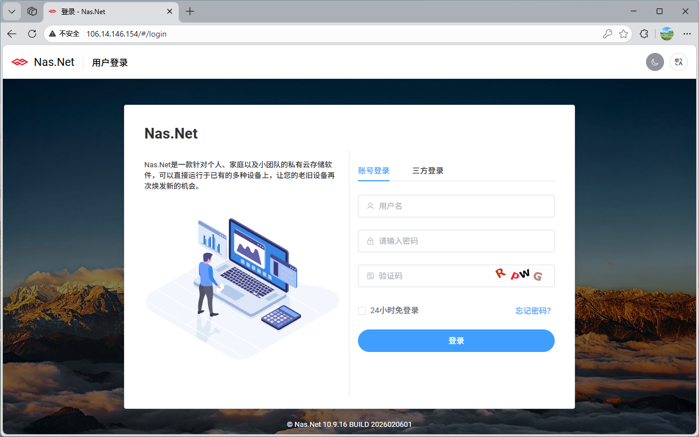
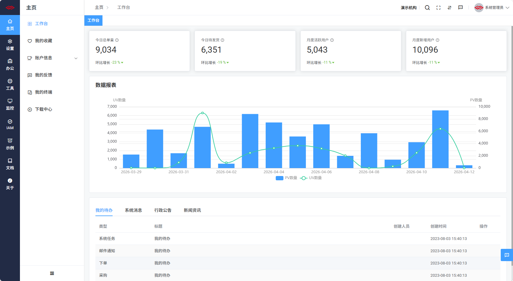
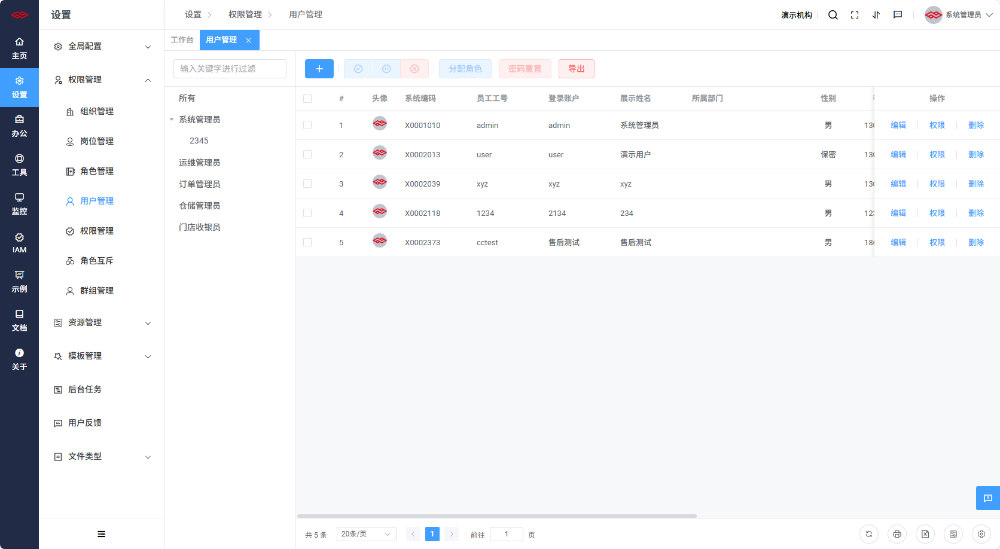
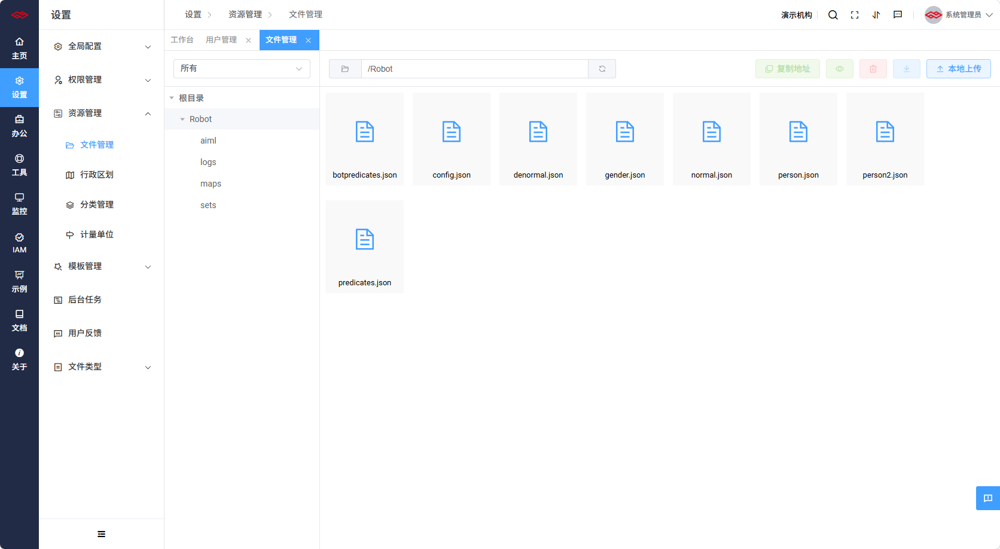
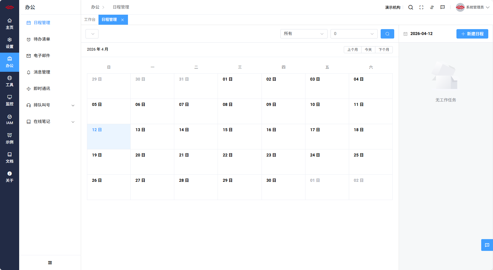
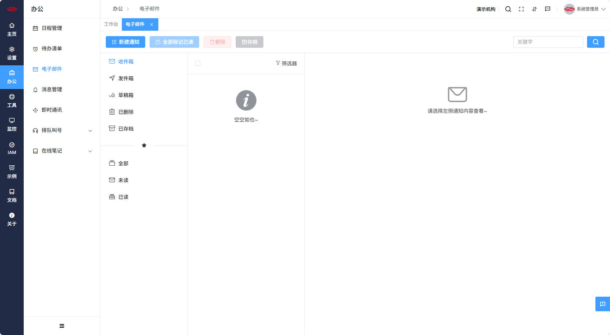
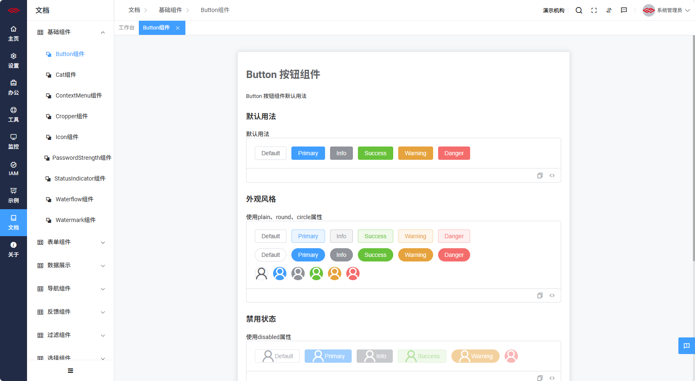
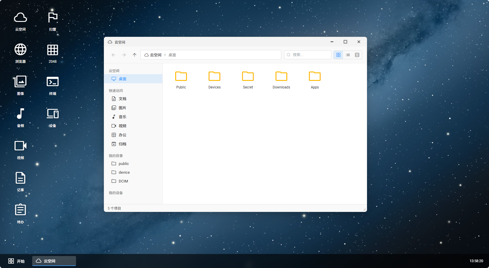
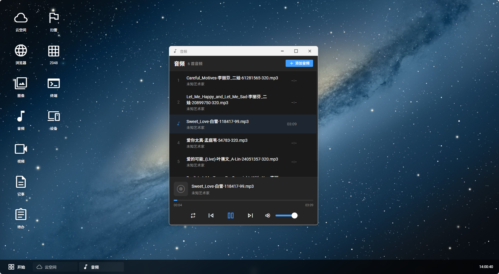
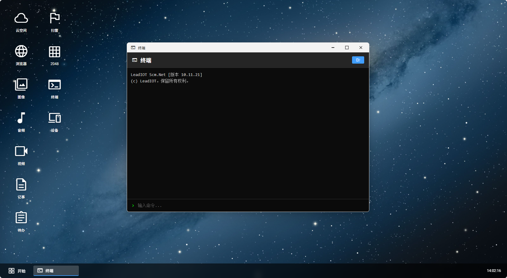

<p align="center">
  
</p>

<h1 align="center">Scm.Vue</h1>

<p align="center">
  <a href="https://gitee.com/leadiot/scm.vue">
    
  </a>
  <a href="https://vuejs.org/">
    
  </a>
  <a href="https://vitejs.dev/">
    
  </a>
  <a href="https://element-plus.org/">
    
  </a>
  <a href="https://pinia.vuejs.org/">
    
  </a>
  
</p>

<p align="center">
  <b>Frontend for Scm.Net</b> — An enterprise-level admin rapid development framework built with Vue 3 + Vite + Element Plus.
</p>

<p align="center">
  Backend: <a href="https://gitee.com/leadiot/scm.net">.Net 10.0</a> ｜
  <a href="http://www.c-scm.net">Live Demo</a> ｜
  <a href="https://gitee.com/leadiot/scm.net/wikis/项目介绍">Documentation</a>
</p>

---

## 📖 Introduction

**Scm.Vue** is the frontend of the [Scm.Net](https://gitee.com/leadiot/scm.net) rapid development framework. It adopts a front-end/back-end separation architecture and is equipped with enterprise-grade core capabilities including permission management, code generation, workflow engine, real-time messaging, and data visualization.

The project integrates three UI modes — **Console** (workbench), **Desktop** (cloud desktop), and **Monitor** (data dashboard) — to suit diverse business scenarios.

> Built with .Net 10.0 / Vue 3.0, designed for rapid development of enterprise admin systems.

---

## ✨ Key Features

### Authentication & Security
- **Multiple Login Methods** — Account, phone, email, OIDC third-party login
- **Data Encryption** — Encrypted parameter signing for front-end/back-end transmission
- **Permission Control** — Six-level permission system: company/department/position/group/user/role
- **Directive-level Auth** — `v-auth`, `v-role` custom directives for element visibility

### System & Framework
- **Dynamic Routing** — Backend-driven menu routes, supports flat navigation and breadcrumbs
- **Code Generator** — Auto-generates front-end and back-end CRUD code
- **Workflow Engine** — Visual process designer, custom approval flows
- **i18n Internationalization** — Built-in Chinese/English language packs, Element Plus locale sync
- **Theme Customization** — Light/Dark themes, custom accent colors

### Business Capabilities
- **Real-time Messaging** — SignalR-based WebSocket push and online chat
- **Data Visualization** — ECharts chart integration, dashboard layout
- **File Management** — File upload, import/export, image cropping (Cropper.js)
- **Notifications** — In-site messages, system alerts, email notifications
- **PWA Support** — Installable as a desktop application

### UI/UX
- **Multi-layout Modes** — Console / Desktop / Monitor layouts
- **Console Layout Styles** — default / header / menu / dock
- **40+ Business Components** — scTable, scSearch, scUpload, scDynamicForm, ready to use
- **Multi-tab Pages** — Tab navigation with collapsible menu
- **Light/Dark Theme** — One-click dark mode toggle

---

## 🛠 Tech Stack

| Technology | Version | Description |
| --- | --- | --- |
| [Vue](https://vuejs.org/) | ^3.5.32 | Progressive JavaScript Framework |
| [Vite](https://vitejs.dev/) | ^8.0.3 | Next-gen Build Tool (Rolldown bundling) |
| [Vue Router](https://router.vuejs.org/) | ^5.0.4 | Official Router for Vue.js (Hash mode) |
| [Pinia](https://pinia.vuejs.org/) | ^3.0.0 | Vue.js State Management |
| [Element Plus](https://element-plus.org/) | ^2.13.6 | Vue 3 Desktop Component Library |
| [Axios](https://axios-http.com/) | ^1.7.0 | HTTP Client (request/response interceptors) |
| [ECharts](https://echarts.apache.org/) | ^6.0.0 | Data Visualization Library |
| [Sass](https://sass-lang.com/) | ^1.99.0 | CSS Preprocessor |
| [SignalR](https://learn.microsoft.com/en-us/aspnet/core/signalr) | ^10.0.0 | Real-time Web Communication (@microsoft/signalr) |
| [Vue I18n](https://vue-i18n.intlify.dev/) | ^11.0.0 | Internationalization Plugin |
| [Cropper.js](https://fengyuanchen.github.io/cropperjs/) | ^1.6.2 | Image Cropping |
| [CryptoJS](https://github.com/brix/crypto-js) | ^4.2.0 | Front-end Data Encryption |
| [Highlight.js](https://highlightjs.org/) | ^11.11.1 | Code Syntax Highlighting |
| [Pinyin Pro](https://github.com/zh-lx/pinyin-pro) | ^3.24.0 | Chinese Pinyin Conversion |
| [NProgress](https://ricostacruz.com/nprogress) | Custom ESM | Page Loading Progress Bar |

---

## 🔧 Requirements

- **Node.js** >= 18.0.0
- **npm** >= 9.0.0 or **pnpm** >= 8.0.0

---

## 🚀 Quick Start

```bash
# 1. Clone the repository
git clone https://gitee.com/leadiot/scm.vue.git

# 2. Enter frontend directory
cd Scm.Vue

# 3. Install dependencies
npm install

# 4. Start dev server (default http://localhost:2800)
npm run dev
```

### Available Commands

| Command | Description |
| --- | --- |
| `npm run dev` | Start development server |
| `npm run serve` | Same as `dev` |
| `npm run build` | Build for production (ESBuild minify) |
| `npm run preview` | Preview production build |
| `npm run lint` | ESLint code check |

---

## 🌐 Environment Variables

The project uses `.env` files for environment configuration. Priority: `.env.production` > `.env.development` > `.env`.

| Variable | Description | Default |
| --- | --- | --- |
| `VITE_APP_VER` | App version | `10.14.31` |
| `VITE_APP_BUILD` | Build date | `2026051201` |
| `VITE_APP_CODE` | App code | `Scm.Net` |
| `VITE_APP_NAME` | App name | `AppName` |
| `VITE_APP_DESC` | App description (supports HTML) | |
| `VITE_API_BASE` | Backend API URL | `http://localhost:5000` |
| `VITE_WEB_PORT` | Frontend dev port | `2800` |
| `VITE_APP_PROXY` | Enable proxy | `true` |
| `VITE_APP_OIDC_KEY` | OIDC app key | 08dc965832db7248 |
| `VITE_APP_OIDC_AUTH` | OIDC auth URL | oidc.org.cn |
| `VITE_APP_OIDC_LOGIN` | OIDC login URL | oidc.org.cn |
| `VITE_APP_OIDC_REDIRECT_URI` | OIDC redirect URI | varies by environment |

> **Note**: Variables with the `OIDC_` prefix relate to third-party federated login — do not modify without proper understanding.

---

## 📁 Directory Structure

```
Scm.Vue/
├── public/                     # Static assets (not processed by Vite)
│   ├── images/                 #   - Images (logo, favicon, share images)
│   ├── lib/                    #   - Third-party libraries (esm, pdf, Excel, etc.)
│   ├── logo/                   #   - PWA icons
│   ├── scicon/                 #   - Custom icon font
│   ├── material-symbols/       #   - Material Symbols icons
│   ├── favicon.ico / .svg      #   - Site icons
│   └── manifest.json           #   - PWA manifest
├── src/
│   ├── api/                    # API layer
│   │   ├── index.js            #   - Unified API entry
│   │   └── model/              #   - Business API modules (SCM, NAS, login, etc.)
│   ├── assets/                 # Resource files
│   │   ├── mp3/                #   - Notification sounds
│   │   └── sass/               #   - Global SCSS variables & mixins
│   ├── components/             # Global business components (40+)
│   │   ├── scTable/            #   - Enhanced table component
│   │   ├── scSearch/           #   - Search bar component
│   │   ├── scUpload/           #   - File upload component
│   │   ├── scDynamicForm/      #   - Dynamic form component
│   │   ├── scDynamicTable/     #   - Dynamic table component
│   │   ├── scDialog/           #   - Dialog component
│   │   ├── scFilterBar/        #   - Filter bar component
│   │   └── ...                 #   More components...
│   ├── config/                 # Global configuration
│   │   ├── index.js            #   - System config (from env vars)
│   │   ├── route.js            #   - Static route config
│   │   ├── table.js            #   - Default table config
│   │   ├── upload.js           #   - Upload config
│   │   └── workflow.js         #   - Workflow config
│   ├── directives/             # Custom directives
│   │   ├── auth.js             #   - Auth check (v-auth)
│   │   ├── role.js             #   - Role check (v-role)
│   │   ├── copy.js             #   - One-click copy (v-copy)
│   │   └── time.js             #   - Time formatting (v-time)
│   ├── layout/                 # Layout components
│   │   ├── console/            #   - Console layout (main)
│   │   ├── desktop/            #   - Cloud desktop layout (Windows-like)
│   │   ├── monitor/            #   - Monitor layout (data dashboard)
│   │   ├── none/               #   - Empty layout (login page, etc.)
│   │   └── other/              #   - 404, blank pages, etc.
│   ├── locales/                # Internationalization
│   │   ├── index.js            #   - i18n initialization
│   │   └── lang/               #   - Language packs (zh-cn / en)
│   ├── router/                 # Router
│   │   ├── index.js            #   - Router instance + navigation guard
│   │   ├── systemRouter.js     #   - Built-in system routes
│   │   └── scrollBehavior.js   #   - Scroll behavior control
│   ├── stores/                 # Pinia state management
│   │   ├── index.js            #   - Pinia instance
│   │   ├── global.js           #   - Global state (theme, layout, locale, etc.)
│   │   ├── keepAlive.js        #   - Page cache management
│   │   ├── viewTags.js         #   - Multi-tab management
│   │   └── iframe.js           #   - iframe page management
│   ├── style/                  # Global styles
│   │   └── style.scss          #   - Main style entry
│   ├── utils/                  # Utility functions
│   │   ├── tool.js             #   - General utilities (storage, date, formatting)
│   │   ├── request.js          #   - Axios wrapper (interceptors, cache, encryption)
│   │   ├── crypto.js           #   - Encryption/decryption tools
│   │   ├── socket.js           #   - SignalR real-time communication
│   │   ├── permission.js       #   - Permission check utilities
│   │   ├── color.js            #   - Color processing utilities
│   │   ├── errorHandler.js     #   - Global error handler
│   │   ├── exportToExcel.js    #   - Excel export
│   │   └── verificate.js       #   - Form validation functions
│   ├── views/                  # Page views
│   │   ├── login/              #   - Login / Register / Reset password
│   │   ├── home/               #   - Console home / Cloud desktop / Monitor
│   │   ├── scm/                #   - SCM business modules
│   │   ├── nas/                #   - NAS module
│   │   ├── oauth/              #   - OIDC federated login
│   │   ├── about/              #   - About page
│   │   └── ...                 #   More business pages
│   ├── scui.js                 # SCUI framework registration (global components/directives/icons)
│   ├── App.vue                 # Root component (dynamic layout switching)
│   └── main.js                 # Application entry
├── .env                        # Common environment variables
├── .env.development            # Development environment variables
├── .env.production             # Production environment variables
├── .editorconfig               # Editor code style config
├── .gitignore                  # Git ignore rules
├── eslint.config.js            # ESLint configuration
├── vite.config.js              # Vite build config (proxy / chunking / aliases)
├── jsconfig.json               # JS compilation config (path alias hints)
├── package.json                # Project dependencies & scripts
└── LICENSE                     # MIT License
```

---

## 🎨 Screenshots

### Login Page


### Console Mode
| Feature | Screenshot |
| --- | --- |
| Dashboard |  |
| User Management |  |
| File Management |  |
| Calendar |  |
| Email |  |
| System Monitor |  |
| Online Docs |  |

### Cloud Desktop Mode
| Feature | Screenshot |
| --- | --- |
| Desktop Home |  |
| Cloud File Manager |  |
| Notepad |  |
| Image Viewer |  |
| Audio Player |  |
| Todo List |  |
| Terminal |  |

---

## 🧪 Demo Account

| Role | Login User | Password |
| --- | --- | --- |
| Administrator | `admin` | `123456` |

> Demo site: http://www.c-scm.net

---

## 🌍 Browser Support

| Browser | Minimum Version |
| --- | --- |
|  | Chrome >= 80 |
|  | Firefox >= 75 |
|  | Safari >= 13 |
|  | Edge >= 80 |

> IE 11 and below are not supported.

---

## 📦 Build & Deploy

```bash
# Production build
npm run build

# Output goes to dist/
# Deploy dist/ to Nginx / IIS / static file server

# Preview the build locally
npm run preview
```

> **Note**: Make sure to configure `VITE_API_BASE` correctly in `.env.production` to point to your backend API.

---

## 🔗 Related Links

- [Scm.Net Backend](https://gitee.com/leadiot/scm.net) — .Net 10.0 backend framework
- [Online Documentation](https://gitee.com/leadiot/scm.net/wikis/项目介绍) — Full development docs
- [Live Demo](http://www.c-scm.net) — Experience the system

---

## 📄 License

This project is open-sourced under the [MIT License](LICENSE).

---

## 💬 Contact & Feedback

[](https://qm.qq.com/cgi-bin/qm/qr?k=415872667)


